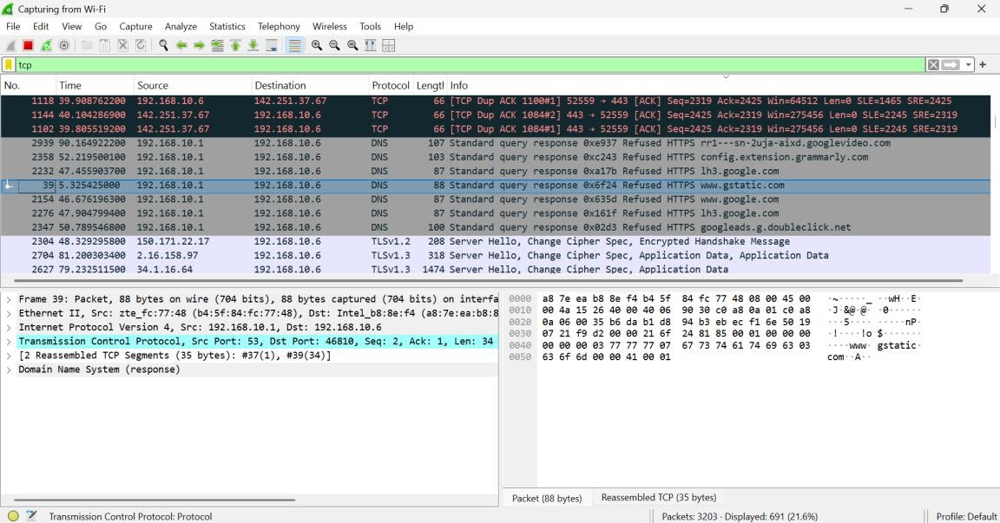
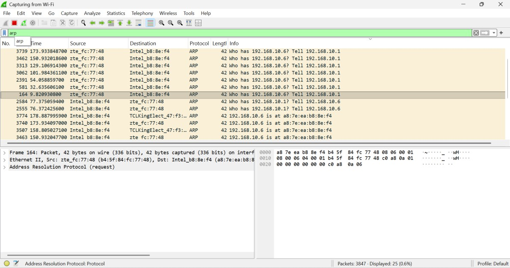
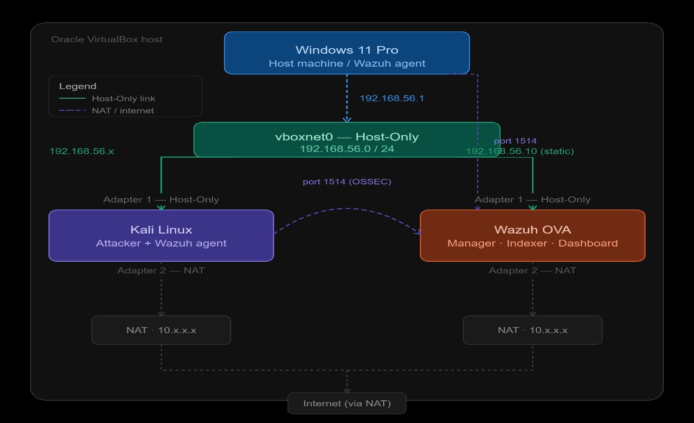
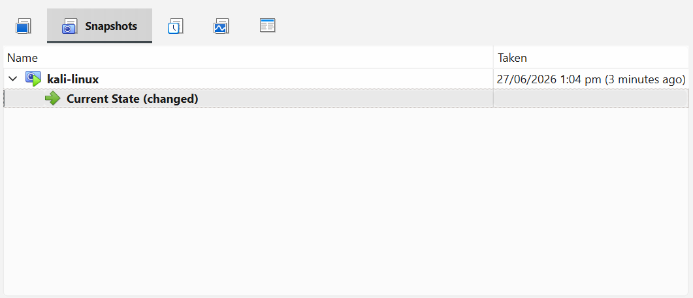
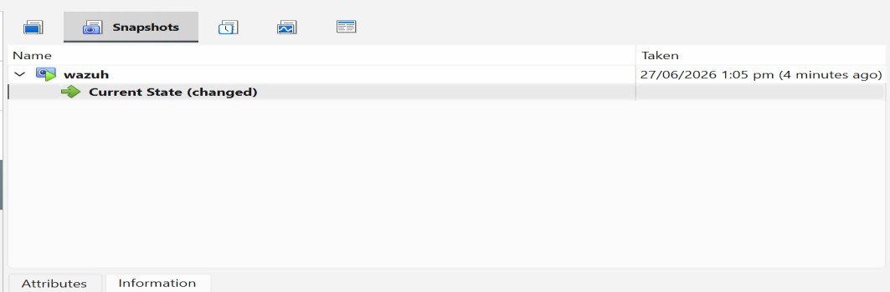
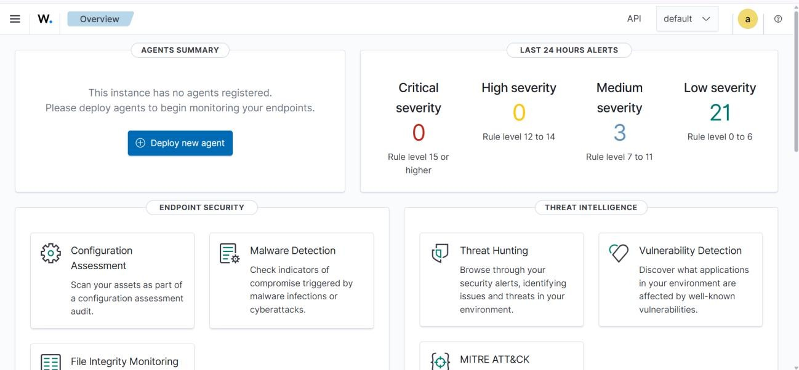
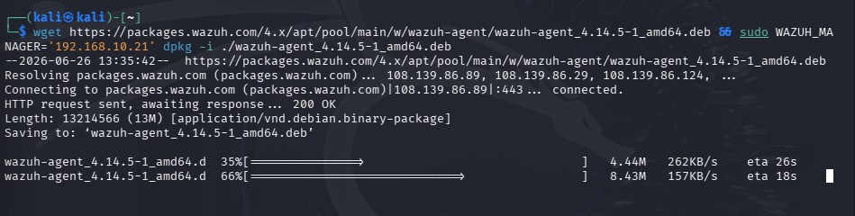
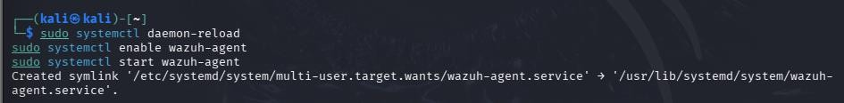
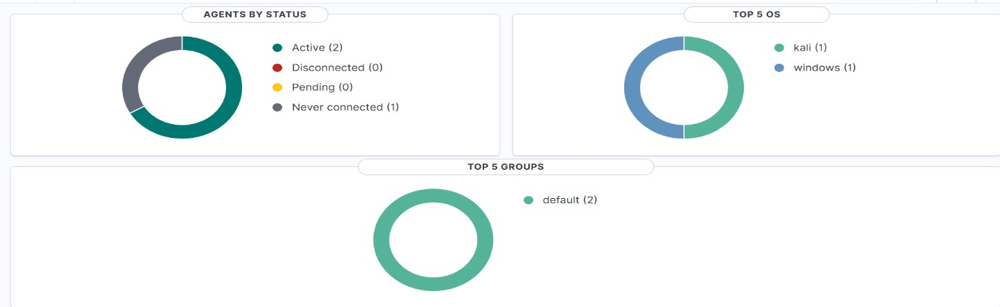

# Week 1 — SOC Foundations and Lab Setup

**Program:** Cyberster Blue Team Internship
**Phase:** Phase One — SOC Operations and SIEM Foundations
**Week:** Week 1 (Days 1–7)

## Summary
Built a defensive security lab from scratch on Windows 11 Pro using Oracle VirtualBox, deployed the Wazuh SIEM
stack and a Kali Linux VM via pre-built OVA images, connected both as monitored/monitoring endpoints, and
performed initial dashboard navigation and alert triage.

## Day-by-Day Breakdown

**Day 1 — Networking Fundamentals for SOC**
Reviewed TCP/IP and OSI models, subnetting and CIDR, common SOC-relevant ports (22, 53, 80, 443, 445, 3389,
etc.), and protocol deep-dives (ARP, DNS, HTTP/HTTPS, ICMP) with a focus on identifying suspicious vs. normal
traffic. Ran a 10-minute Wireshark capture on the host to observe baseline traffic.

**Day 2 — Oracle VirtualBox Lab Setup**
Imported the Wazuh OVA and Kali Linux OVA into VirtualBox, configured dual network adapters (Host-Only +
NAT) on each VM, verified IP addressing and inter-VM connectivity, and took baseline snapshots.

**Days 3–4 — Wazuh OVA Installation**
Verified all three Wazuh components (Manager, Indexer, Dashboard) came up correctly on the pre-built OVA and
were reachable.

**Days 5–6 — Wazuh Agent Deployment**
Installed the Wazuh agent on both the Kali Linux VM and the Windows 11 Pro host, confirmed both registered
and reported as active/connected to the manager.

**Day 7 — Dashboard Navigation and Alert Triage**
Worked through the Wazuh dashboard's Security Alerts view, applied filters, and assessed whether detected
activity represented genuine security concerns or routine noise.

## Evidence Screenshots

| # | Screenshot | Description |
|---|---|---|
| 1 |  | Wireshark running on Windows 11 Pro — capture showing DNS, TLS, and TCP traffic |
| 2 |  | Wireshark running on Windows 11 Pro — capture showing ARP traffic |
| 3 |  | VirtualBox lab topology — Wazuh OVA and Kali Linux OVA connected via Host-Only network to the Windows 11 Pro host |
| 4 |  | VirtualBox Snapshot Manager — baseline snapshot created for the Kali Linux VM |
| 5 |  | VirtualBox Snapshot Manager — baseline snapshot created for the Wazuh OVA |
| 6 |  | Wazuh Dashboard Overview page after successful login |
| 7 |  | Kali Linux terminal — Wazuh agent installation command being executed |
| 8 |  | Kali Linux terminal — enabling and starting the Wazuh agent service |
| 9 |  | Wazuh Dashboard — both agents (Kali, Windows 11 Pro) showing Active status |
