# Week 2 — Detection, Custom Rules, and Log Analysis

**Program:** Cyberster Blue Team Internship
**Phase:** Phase One — SOC Operations and SIEM Foundations
**Week:** Week 2 (Days 8–14)
**Lab Environment:** Kali Linux agent, Windows 11 Pro agent, Wazuh v4.14.5 OVA

## Summary
Configured and validated three detection capabilities end to end — File Integrity Monitoring (FIM), custom
detection rules, and automated active response — alongside a structured log analysis exercise across both
Linux and Windows log sources.

## Day-by-Day Breakdown

**Days 8–9 — File Integrity Monitoring (FIM)**
Configured syscheck on the Linux agent (default 600s frequency, scan_on_start). Created, modified, and
deleted a test file on the Windows 11 Pro agent, and confirmed all three FIM alerts (file added → checksum
changed → file deleted) appeared correctly in the Wazuh Events view.

**Days 10–11 — Custom Wazuh Rules**
Wrote three custom rules in `local_rules.xml`: new Linux user account creation (rule 100001), repeated failed
SSH logins escalating through frequency rules, and a USB detection rule. Restarted the manager and confirmed
each rule fired correctly against simulated activity.

**Days 12–13 — Log Analysis Fundamentals**
Broadened log coverage in `ossec.conf` (netstat, web server access/error logs). Analyzed Windows Security
Event Log equivalents — logon failures, special privilege assignment, and account-creation context.

**Day 14 — Active Response**
Configured an active-response block (`firewall-drop`, 300s timeout) triggered by escalating SSH login
failures, and confirmed the offending host was automatically blocked.

## Evidence Screenshots

| # | Screenshot | Description |
|---|---|---|
| 1 | 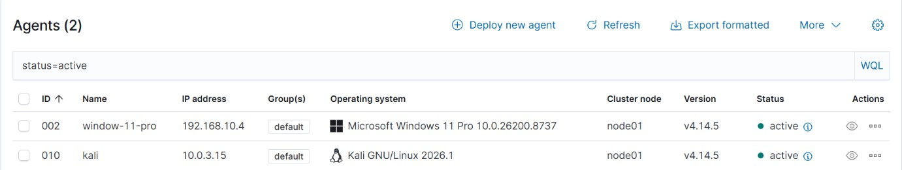 | Wazuh Dashboard — both agents (kali, window-11-pro) reporting Active status |
| 2 | 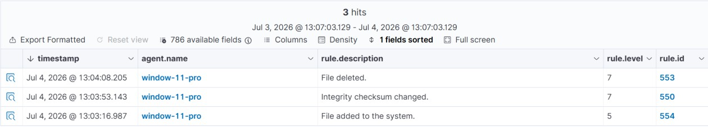 | All three FIM alerts for the test file (added → checksum changed → deleted) |
| 3 | 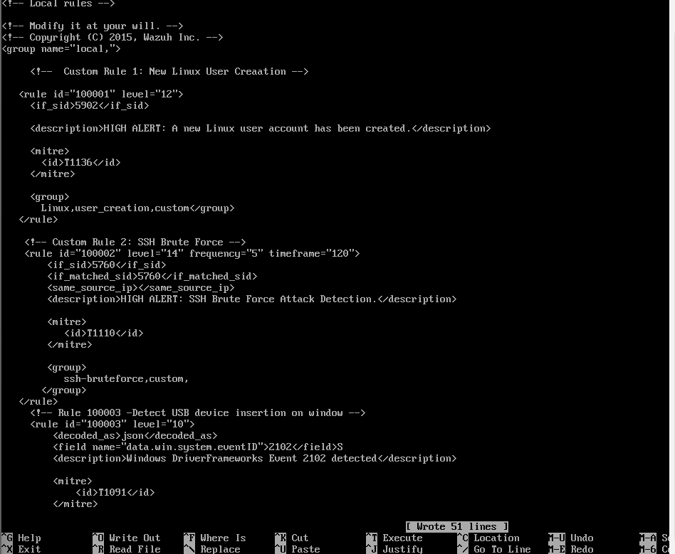 | `local_rules.xml` with all three custom rules in place |
| 4 | 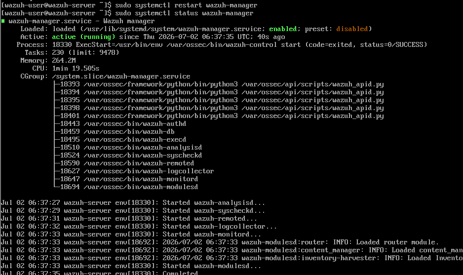 | Wazuh Manager restarted and confirmed active after adding custom rules |
| 5 | 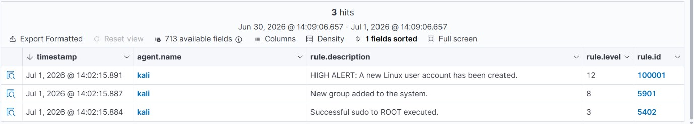 | "HIGH ALERT: new Linux user account created" (rule 100001) firing |
| 6 | 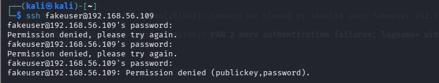 | Repeated failed SSH login attempts from the Kali attack VM |
| 7 | 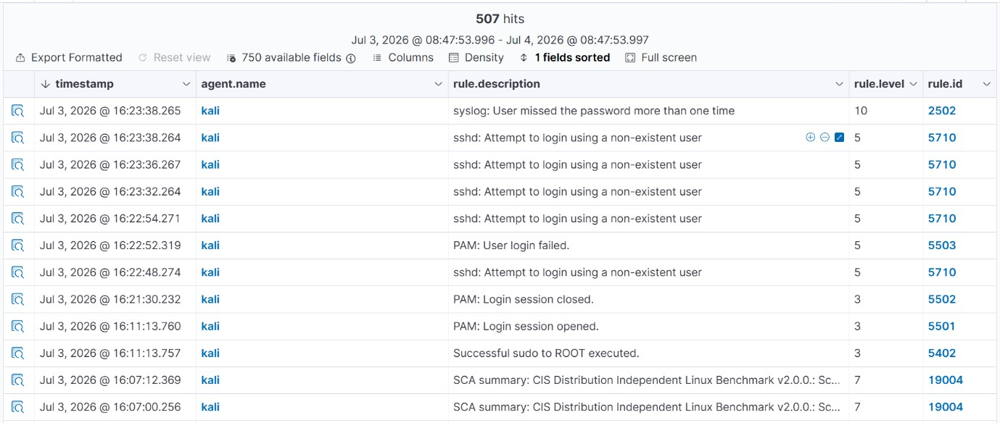 | 507 hits over 24 hours — SSH failure rules escalating |
| 8 | 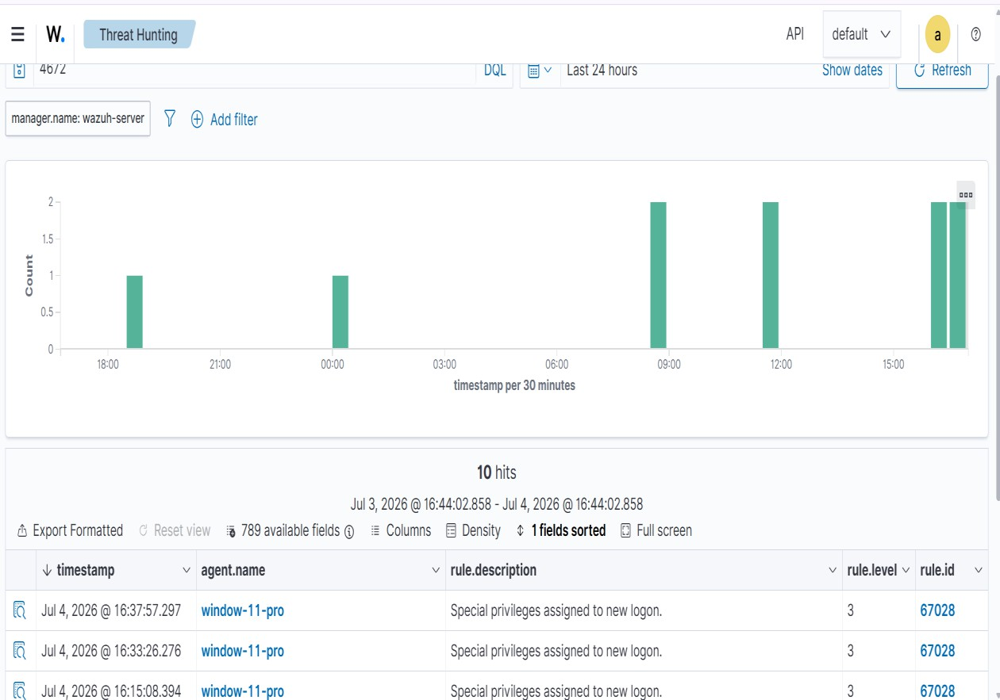 | "Special privileges assigned to new logon" alert (rule 67028) |
| 9 | 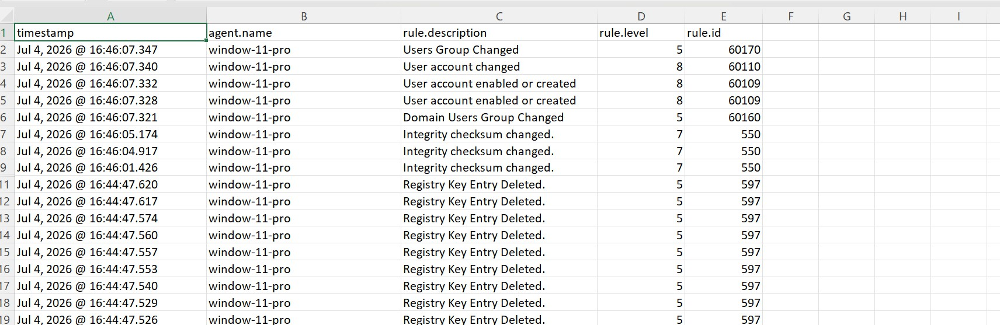 | Full log context around the Windows account-creation event cluster |
| 10 | 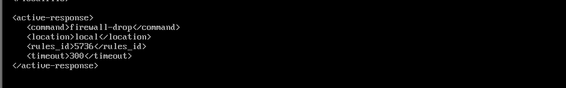 | `firewall-drop` active-response block configuration |
| 11 | 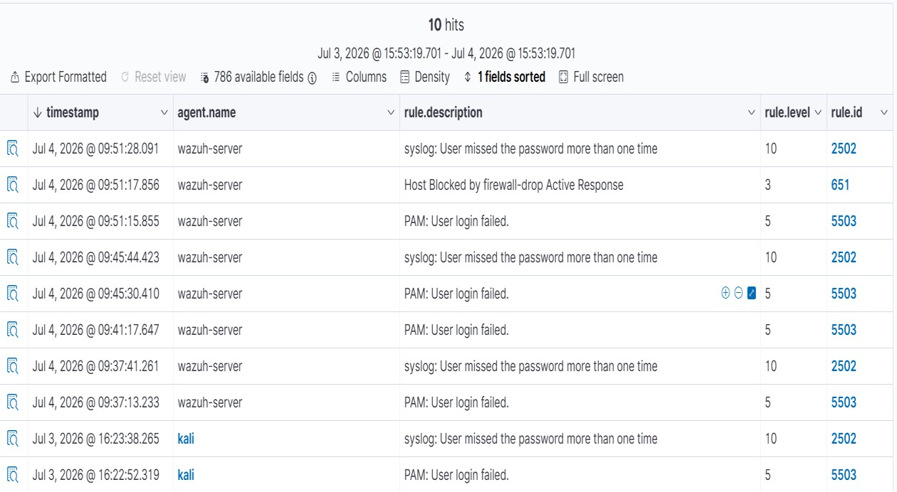 | "Host Blocked by firewall-drop Active Response" alert firing |
