# Week 3 — Suricata IDS Integration with Wazuh

**Program:** Cyberster Blue Team Internship
**Phase:** Phase One — SOC Operations and SIEM Foundations
**Week:** Week 3 (Days 15–21)

## Summary
Installed and configured Suricata IDS on the Kali VM, wrote custom detection rules for three attack scenarios,
integrated the Suricata alert stream into Wazuh for correlation, and implemented GeoIP-based firewall blocking.

## Day-by-Day Breakdown

**Days 15–16 — Suricata Installation and Configuration**
Installed Suricata, configured af-packet to monitor the lab interface, enabled and verified the service, and
confirmed it was inspecting live lab traffic via `fast.log`.

**Day 17 — Suricata Rule Writing**
Wrote three custom rules in `local.rules`: Nmap SYN scan detection, HTTP directory traversal / exploit attempt
detection, and ICMP flood detection. Validated the config and reloaded rules live.

**Days 18–19 — Suricata and Wazuh Integration**
Connected Suricata's `eve.json` alert stream into the Wazuh agent config so network-level detections appear
alongside host-based alerts. Verified all three custom alerts plus default ET signatures in the Wazuh Threat
Hunting dashboard, and correlated Suricata alerts with Windows FIM activity on the same timeline.

**Days 20–21 — GeoIP Blocking and Firewall Rules**
Downloaded country-based IP blocklists (China, Russia, North Korea) from ipdeny.com and configured
iptables-based blocking using them, with additional DNS-level domain blocking via `/etc/hosts`.

## Evidence Screenshots

| # | Screenshot | Description |
|---|---|---|
| 1 | 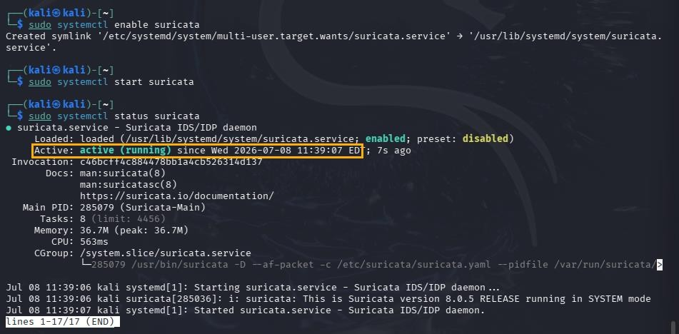 | Suricata service enabled and running |
| 2 | 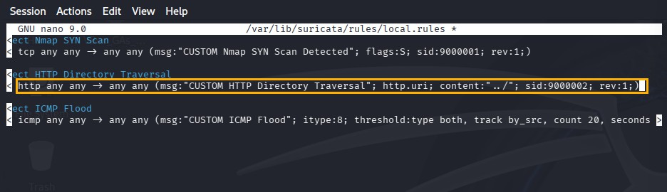 | `local.rules` — Nmap, HTTP exploit, and ICMP flood custom rules |
| 3 | 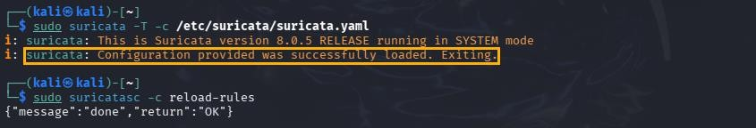 | Suricata config test passing and rules reloaded live |
| 4 | 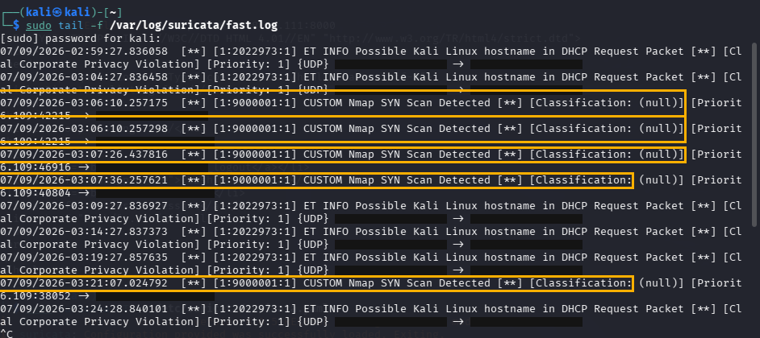 | `fast.log` showing repeated Nmap SYN Scan alerts during a real scan |
| 5 | 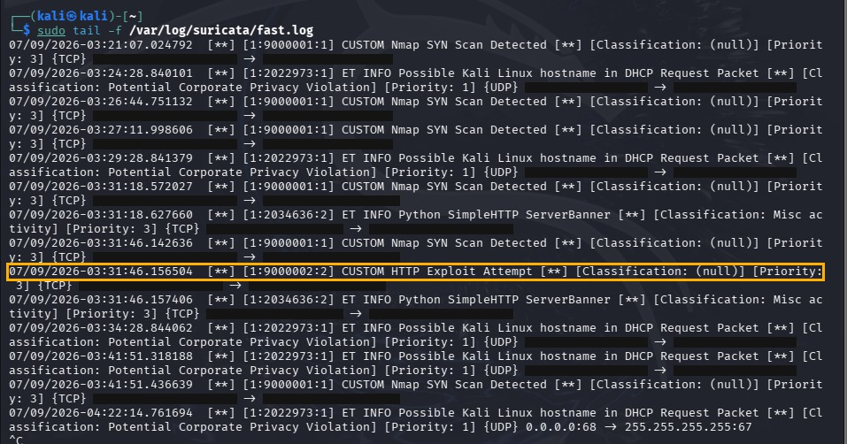 | Custom HTTP Exploit Attempt alert firing |
| 6 | 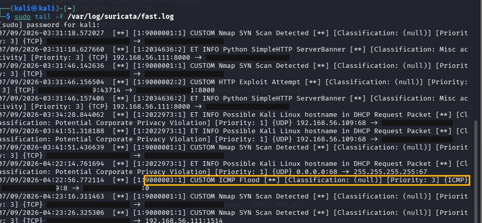 | Custom ICMP Flood alert firing |
| 7 | 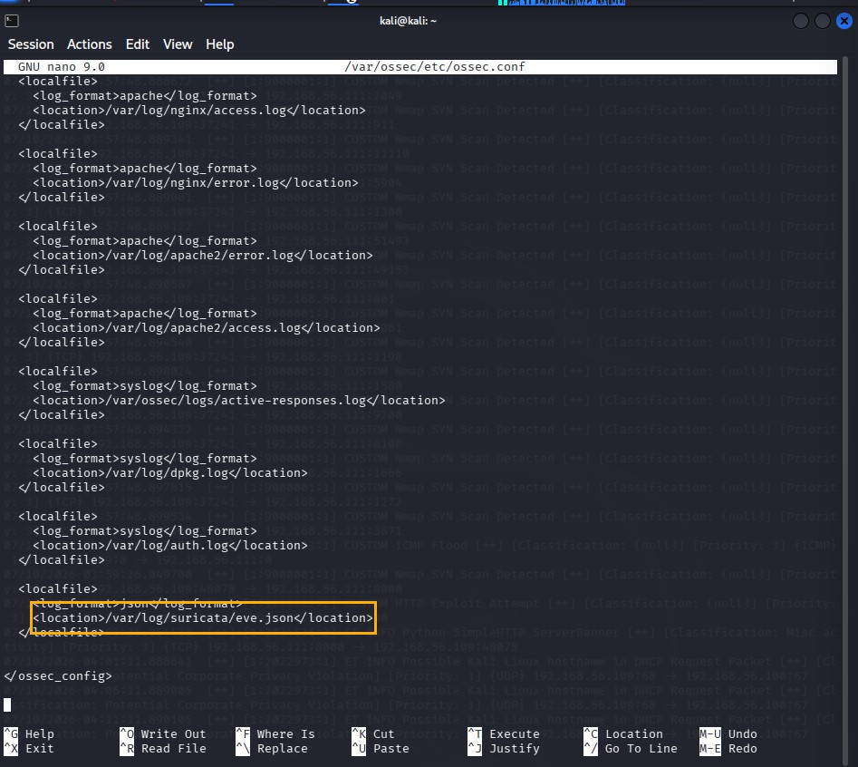 | `ossec.conf` configured to ingest Suricata's `eve.json` alert stream |
| 8 | 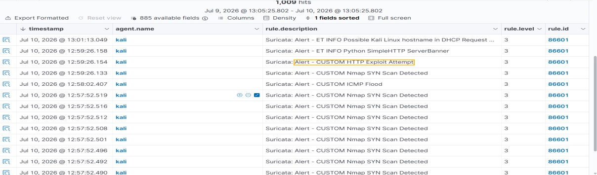 | Wazuh Events table listing individual Suricata alerts |
| 9 | 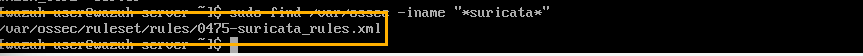 | Built-in Suricata rule file located on the Wazuh Manager |
| 10 | 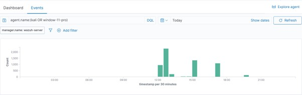 | Combined Threat Hunting view — Suricata alerts correlated with Windows FIM |
| 11 | 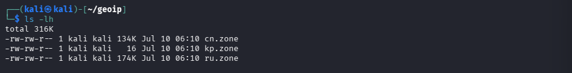 | Country blocklist files downloaded (cn/ru/kp.zone) |
| 12 | 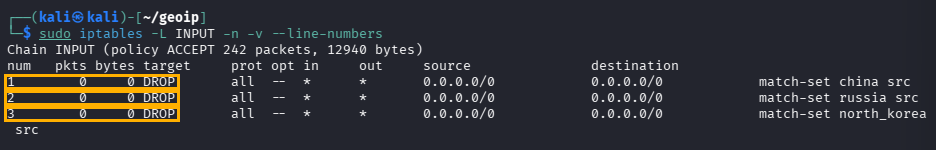 | iptables INPUT chain confirming GeoIP DROP rules in place |
| 13 | 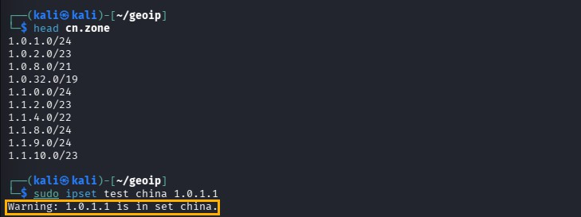 | Verification that traffic from blocked countries is dropped |
| 14 | 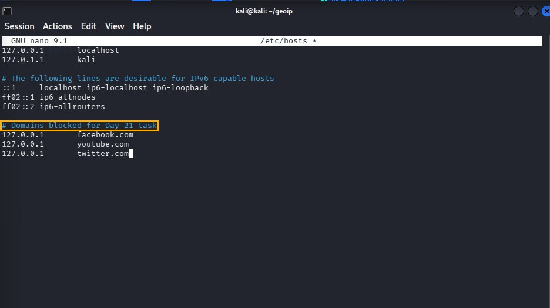 | Domain entries added to `/etc/hosts` for DNS-level blocking |
