# Week 4 — pfSense Firewall and Advanced Monitoring

**Program:** Cyberster Blue Team Internship
**Phase:** Phase One — SOC Operations and SIEM Foundations
**Week:** Week 4 (Days 22–28)

## Summary
Deployed pfSense as the network firewall, integrated VirusTotal threat intelligence with FIM, ran vulnerability
detection against lab agents, patched a discovered vulnerability, and built a custom SOC dashboard summarizing
the week's alert data.

## Day-by-Day Breakdown

**Days 22–23 — pfSense Firewall Setup**
Installed pfSense Community Edition in VirtualBox, configured WAN/LAN adapters, logged into the web UI, and
verified all lab machines could reach the new default gateway. Configured LAN firewall rules with logging
enabled and confirmed logs reached Wazuh via syslog.

**Days 24–25 — Threat Intelligence Integration**
Created a VirusTotal account and API key, integrated it into the Wazuh Manager config, staged an EICAR test
file on a monitored agent, and confirmed the FIM → VirusTotal integration correctly flagged it. Mapped
resulting alerts to MITRE ATT&CK techniques.

**Days 26–27 — Vulnerability Management**
Enabled Wazuh's vulnerability-detection module, reviewed software inventory from both Windows and Ubuntu
agents, found a vulnerable package, patched it, and re-scanned to confirm the finding cleared.

**Day 28 — Custom SOC Dashboard**
Built a custom Week 4 dashboard: alerts by severity, top alert sources by agent, top rules, and alert trends.

## Evidence Screenshots

| # | Screenshot | Description |
|---|---|---|
| 1 | 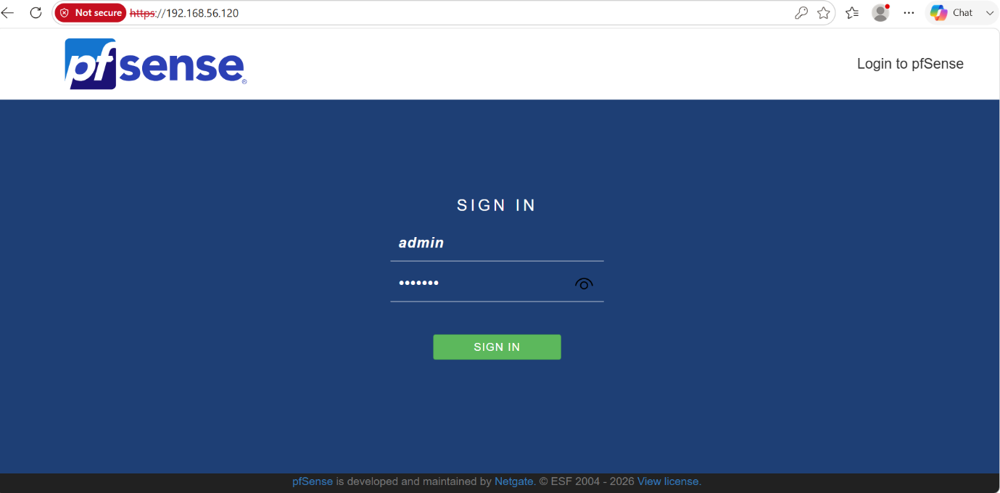 | pfSense dashboard after first login |
| 2 | 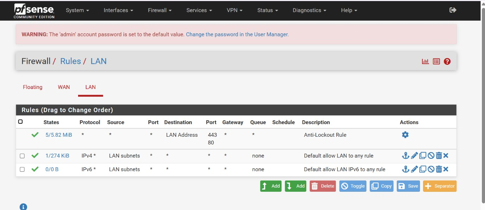 | LAN firewall rules with logging enabled |
| 3 | 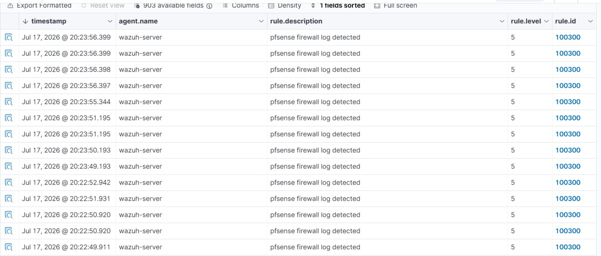 | Wazuh alert detail showing parsed pfSense syslog fields |
| 4 | 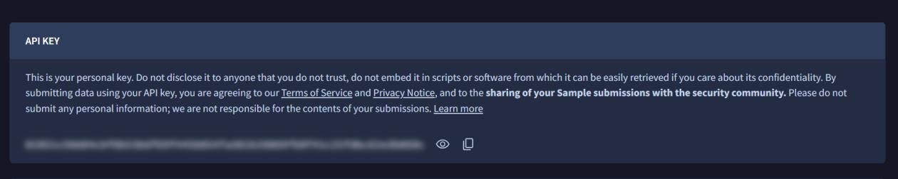 | VirusTotal account created and API key obtained |
| 5 | 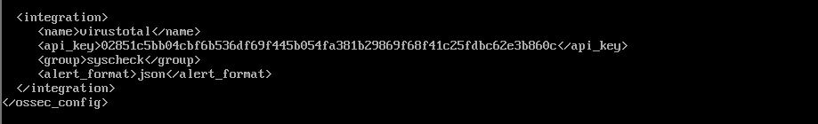 | VirusTotal integration block in Wazuh Manager config |
| 6 | 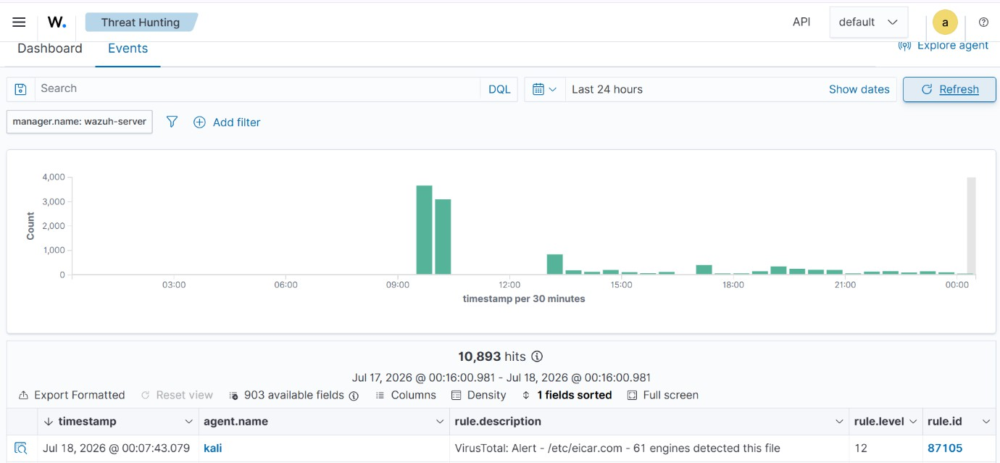 | FIM alert for EICAR test file with VirusTotal detection result |
| 7 | 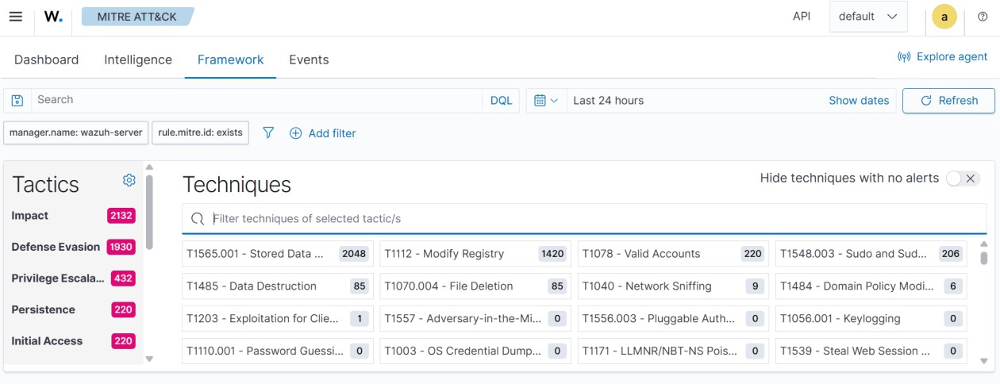 | MITRE ATT&CK dashboard summarizing technique coverage |
| 8 | 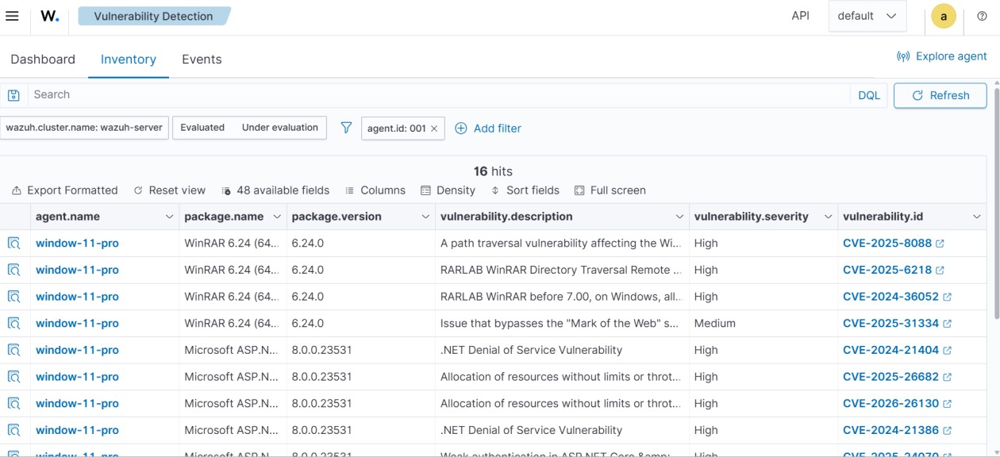 | Windows agent software inventory reporting into Wazuh |
| 9 | 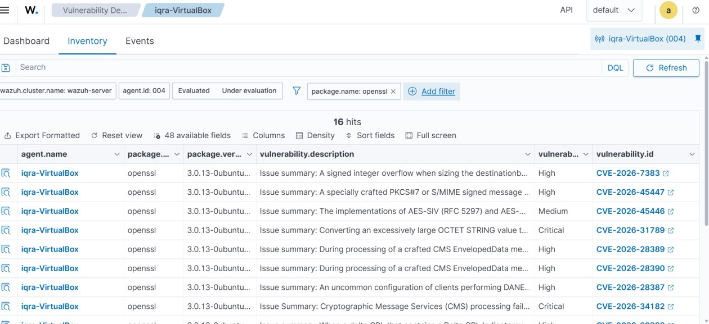 | Vulnerability finding on Ubuntu agent before remediation |
| 10 | 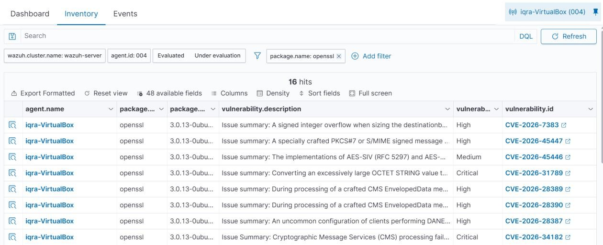 | Rescan confirming the finding cleared after patching |
| 11 | 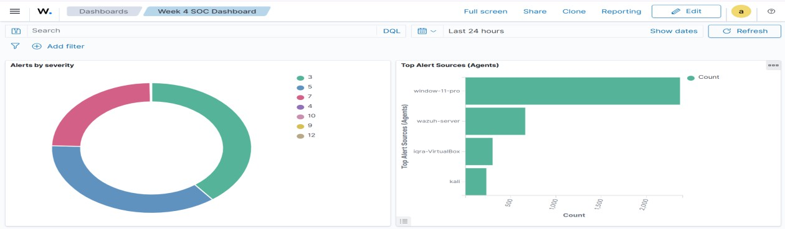 | Final custom Week 4 SOC dashboard (severity, top sources, top rules) |
