# Week 5 — Malware Analysis and Incident Response

**Program:** Cyberster Blue Team Internship
**Phase:** Phase One — SOC Operations and SIEM Foundations
**Week:** Week 5 (Days 29–35)

## Summary
Analyzed two live malware samples (Agent Tesla and Emotet) in an air-gapped Kali Linux VM, using static
analysis, interactive dynamic sandbox analysis, and threat intelligence lookups, then built new Suricata and
Wazuh detection rules directly from the findings.

## Day-by-Day Breakdown

**Days 29–30 — Sample Selection and Justification**
Downloaded Agent Tesla and Emotet samples from theZoo GitHub repository, verified SHA256/MD5 hashes,
confirmed the analysis VM was fully air-gapped (no DNS resolution), and set both samples read-only
(`chmod 400`) before any handling.

**Day 31 — Static Analysis**
Ran `file`, `exiftool`, `binwalk`, and `strings` (ASCII + 16-bit Unicode) against both samples without executing
them. Grepped strings output for DLL references and file/network/registry-relevant API strings. Cross-checked
both samples against VirusTotal for detection summaries, threat labels, and first-seen-in-the-wild history.

**Days 32–33 — Interactive Dynamic Analysis**
Detonated both samples in a sandbox environment. Observed the Emotet process tree (self-replication into a
second Temp-path instance) and network activity, and the Agent Tesla process tree and its network callbacks.

**Days 34–35 — Detection Engineering**
Built new custom Suricata rules and Wazuh detection rules directly from the static and dynamic analysis
findings, confirmed they fired correctly, and compiled an IOC/IOA table covering both samples.

## Evidence Screenshots

| # | Screenshot | Description |
|---|---|---|
| 1 | 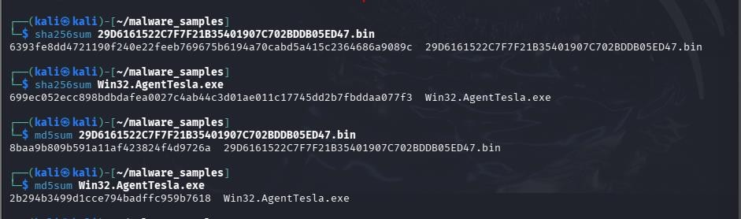 | sha256sum/md5sum output verifying both samples |
| 2 | 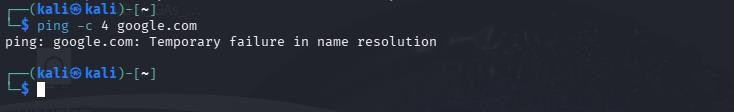 | DNS resolution failure confirming the VM is air-gapped |
| 3 | 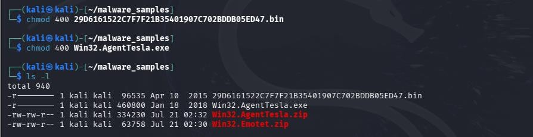 | `chmod 400` applied to both samples before handling |
| 4 | 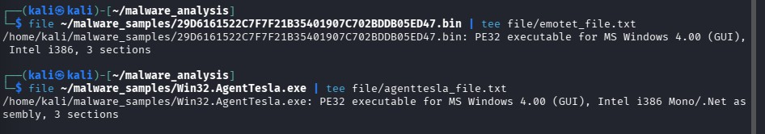 | `file` command output identifying both sample types |
| 5 | 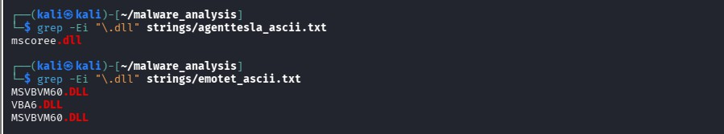 | grep output revealing DLL and API/registry references |
| 6 | 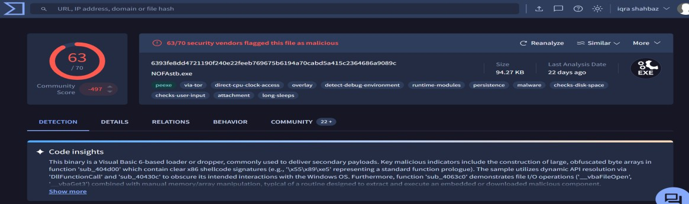 | VirusTotal detection summary for the Emotet sample (63/70 vendors) |
| 7 | 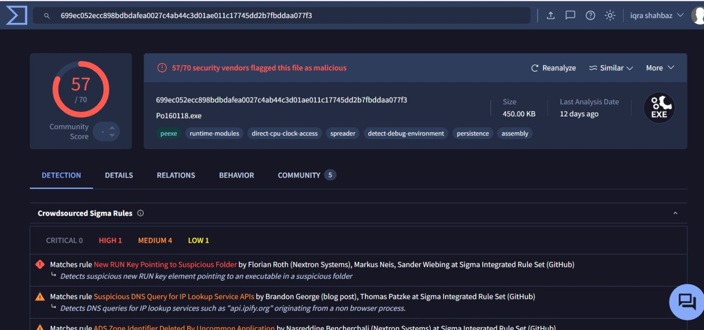 | VirusTotal detection summary for the Agent Tesla sample |
| 8 | 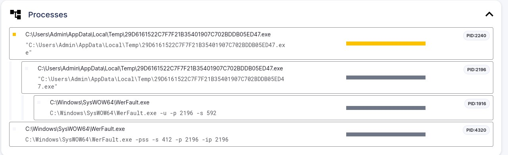 | Sandbox process tree — Emotet spawning a second instance of itself |
| 9 | 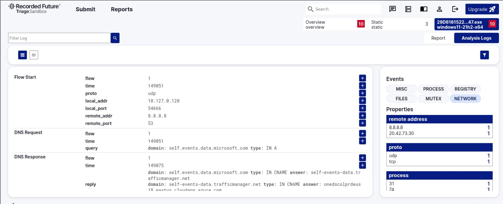 | Sandbox network activity — Emotet DNS/C2 traffic |
| 10 | 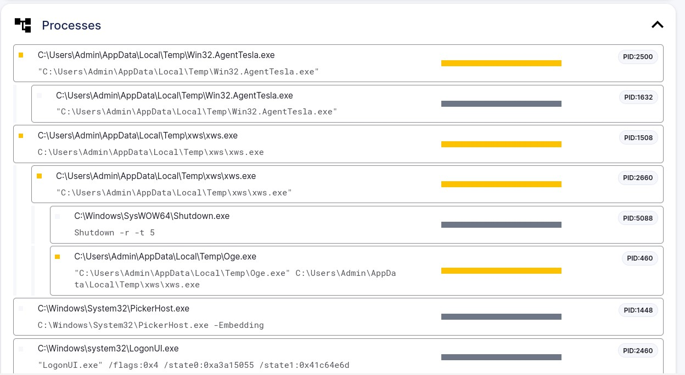 | Sandbox process tree — Agent Tesla dropping/launching child processes |
| 11 | 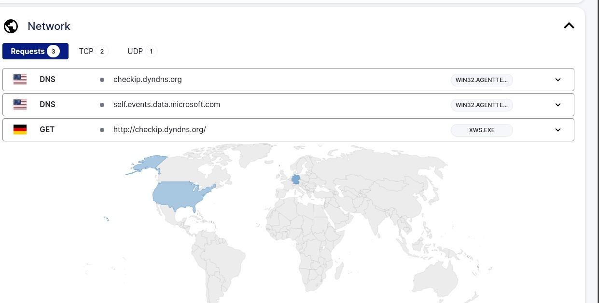 | Sandbox network activity — Agent Tesla callback traffic |
| 12 | 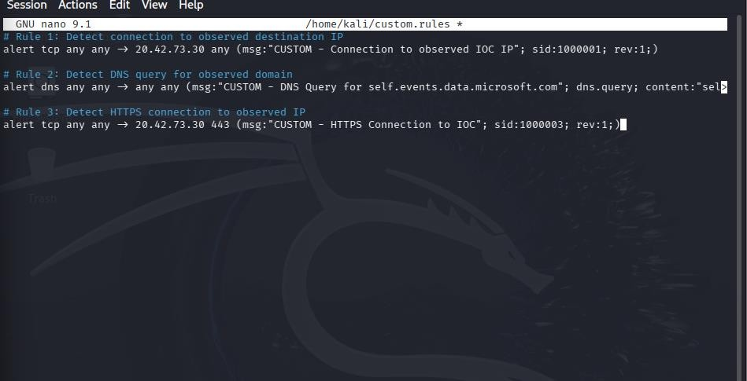 | New custom Suricata rules (`custom.rules`) written from the analysis |
| 13 | 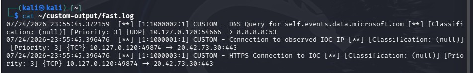 | `fast.log` confirming all custom Suricata rules fired correctly |
| 14 | 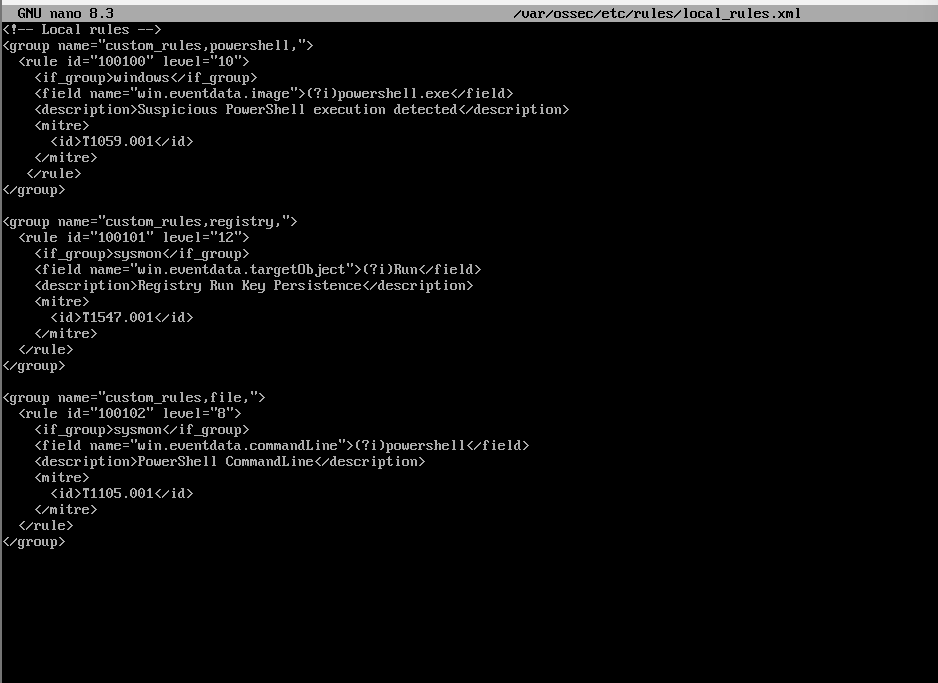 | New custom Wazuh rules added to `local_rules.xml` |
| 15 | 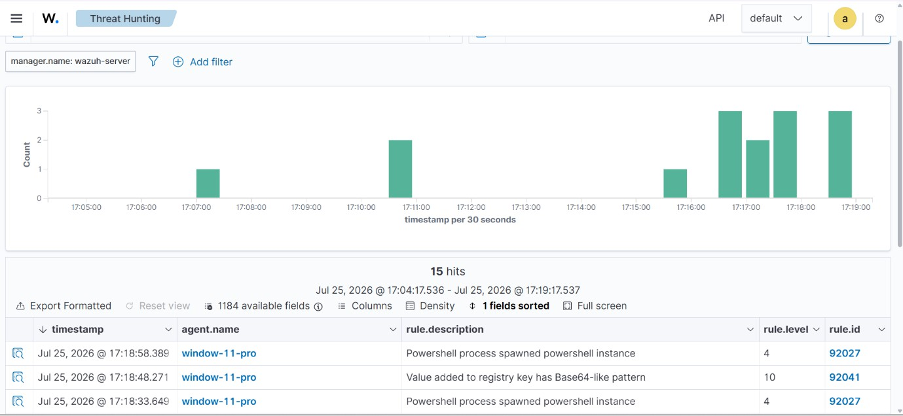 | Wazuh Threat Hunting view confirming the new detection rules fired |
