# Week 6 — Incident Response: Insider Threat Capstone

**Program:** Cyberster Blue Team Internship
**Phase:** Phase One Capstone Simulation
**Framework:** NIST SP 800-61
**Scenario:** Insider Threat — Confidential Client Database Exfiltration and Response

## Summary
End-to-end incident response investigation simulating an insider threat: an internal actor staged confidential
client data, encoded it with Base64 (via `certutil.exe`), exfiltrated it over HTTP to a listener on a Kali VM,
then attempted to delete evidence. Investigated and reported per the NIST SP 800-61 incident response
lifecycle.

## Investigation Breakdown (NIST SP 800-61 phases)

**Preparation**
Wazuh syscheck configured to monitor the sensitive `C:\Espionage` directory, confirmed active following an
agent restart.

**Detection & Analysis**
Correlated FIM events — file modification (rule 553) and file deletion — with the broader Wazuh alert stream.
Identified data staging, Base64 encoding, and HTTP-based exfiltration to an external listener. Decoded the
exfiltrated payload to confirm exactly what data left the environment. Mapped four distinct attacker
techniques to MITRE ATT&CK: staging, encoding for obfuscation, exfiltration over HTTP, and evidence deletion.
Wrote and tested a new custom Wazuh detection rule to close the visibility gap this incident revealed.

**Containment, Eradication & Recovery**
Documented recommendations: account containment for the insider, verification of the broader environment
for similar activity, and expanded FIM/monitoring scope going forward. Noted that access should be restored
with reduced privilege scope pending an HR investigation outcome, not by default.

## Evidence Screenshots

**Investigation Evidence**

| # | Screenshot | Description |
|---|---|---|
| 1 | 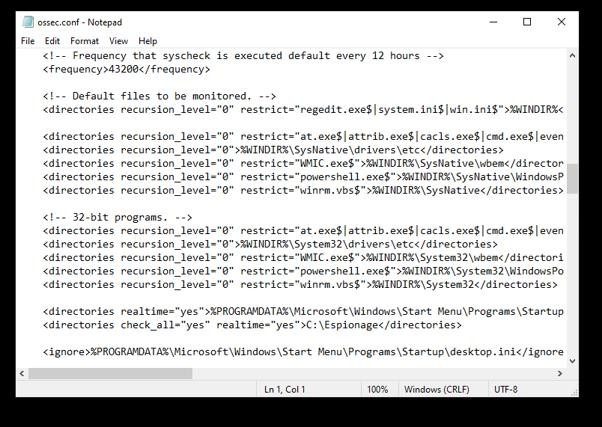 | Wazuh syscheck config monitoring `C:\Espionage` |
| 2 | 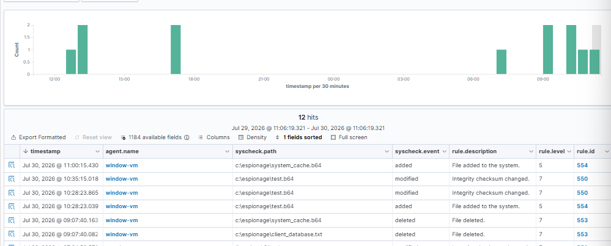 | Wazuh Discover view — FIM rules 554/550/553 firing on file creation and deletion |
| 3 | 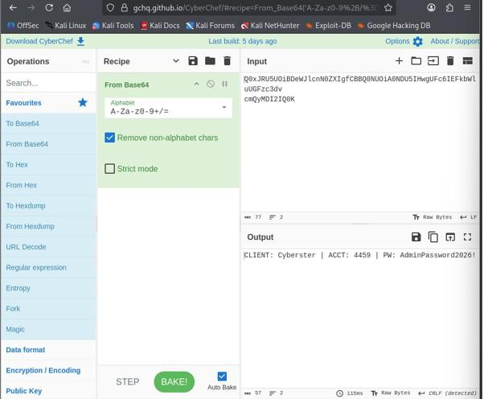 | CyberChef decoding the exfiltrated Base64 payload |
| 4 | 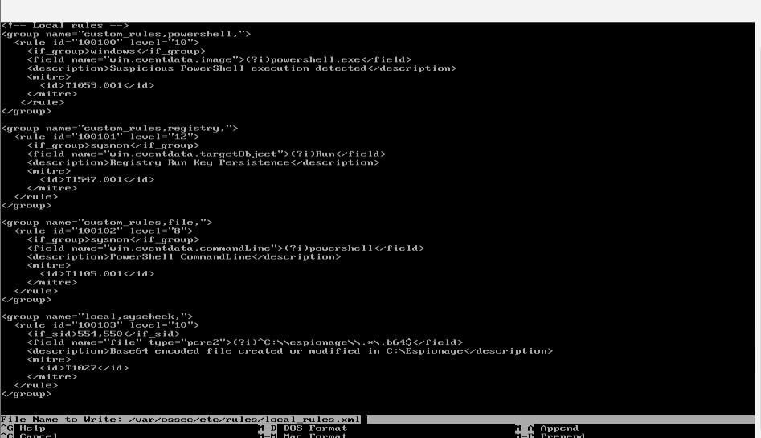 | New custom detection rule added to `local_rules.xml` |
| 5 | 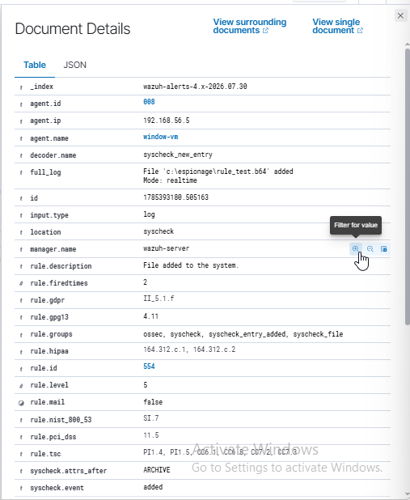 | Custom rule (100010) confirmed firing on a test file |

**Attack Execution Evidence (Reconstructed)**

| # | Screenshot | Description |
|---|---|---|
| 6 | 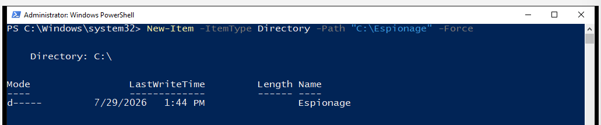 | `C:\Espionage` staging directory created on the target host |
| 7 | 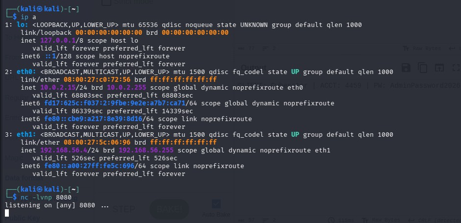 | Kali nc listener started on port 8080, awaiting exfiltrated data |
| 8 | 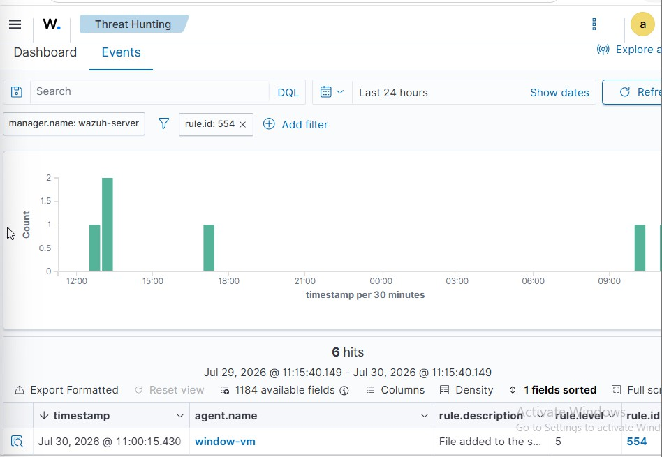 | FIM alert for `Client_Database.txt` creation |
| 9 | 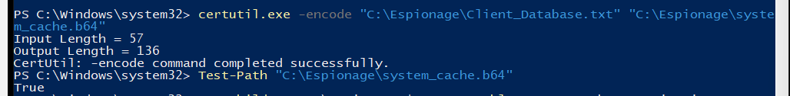 | `certutil.exe` used to Base64-encode the file before exfiltration |
| 10 | 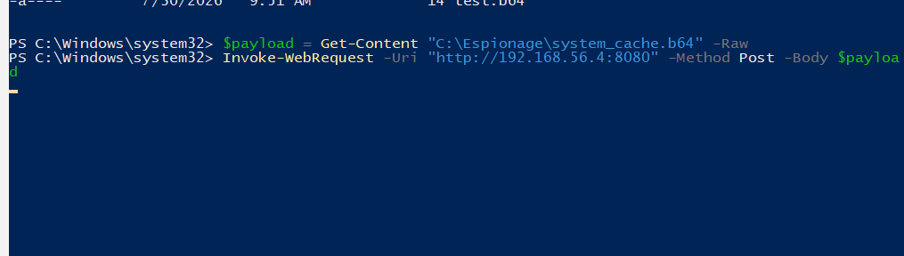 | PowerShell command sending the encoded payload to the listener |
| 11 | 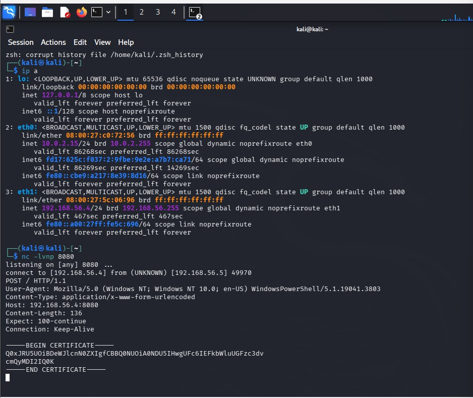 | Encoded payload received at the attacker's nc listener |
| 12 | 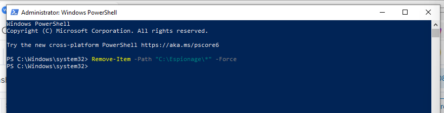 | PowerShell command deleting files in an attempt to cover tracks |
